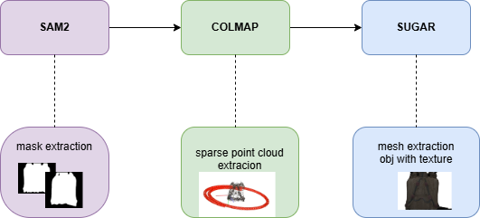

# Nephele — nefele-training

SAM2 + COLMAP + SuGaR/PGSR pipeline for background-free 3D mesh reconstruction.  
The UI lives in the `nefele_ui` branch. This branch runs the GPU training workers.

<p align="center">
  
</p>

---

## Prerequisites

- Docker + NVIDIA container toolkit
- `docker compose` v2
- GPU with CUDA support
- Python 3 + `requests` on the host (for the worker poller)

---

## 1. Clone

```bash
git clone --recurse-submodules -b nefele-training \
  https://github.com/TEXTaiLES/SAMplify_SuGaR.git
cd SAMplify_SuGaR
```

---

## 2. Configure

```bash
cp .env.example .env
# auto-fill paths to this checkout
sed -i "s|/opt/samplify_sugar|$PWD|g" .env
```

Then open `.env` and fill in the two secrets:

| Variable        | What to set              |
|-----------------|--------------------------|
| `HESTIA_API_KEY`| Your HESTIA bearer token |
| `HOST_UID`      | Your user ID (`id -u`)   |
| `HOST_GID`      | Your group ID (`id -g`)  |

---

## 3. Build & start containers

```bash
docker compose build
docker compose up -d sam2 colmap pgsr
```

> `pgsr` clones the PGSR repo from GitHub during build — first build takes a few minutes.

---

## 4. UI (optional — skip if using the standalone nefele_ui branch)

```bash
cp nefele_ui/.env.example nefele_ui/.env
```

Edit `nefele_ui/.env` and set `SAMPLIFY_ROOT` to the absolute path of this checkout, then:

```bash
cd nefele_ui
docker compose up -d ui
```

UI will be available at `http://localhost:8092` (or the `WEB_PORT` you set).

---

## 5. Worker poller (vm_comms mode)

The poller runs on the host (not in a container) and drives the pipeline when jobs arrive from HESTIA.

```bash
pip3 install requests

cp deploy/worker_poller.env.example deploy/worker_poller.env
chmod 600 deploy/worker_poller.env
$EDITOR deploy/worker_poller.env   # set HESTIA_API_URL and HESTIA_API_KEY

sudo sed "s|/opt/samplify_sugar|$PWD|g; s|User=youruser|User=$USER|; s|Group=youruser|Group=$USER|" \
    deploy/worker_poller.service \
    | sudo tee /etc/systemd/system/worker_poller.service > /dev/null

sudo systemctl daemon-reload
sudo systemctl enable --now worker_poller
journalctl -u worker_poller -f
```

---

## Related docs

- `deploy/README.md` — more detail on the worker poller
- `nefele_ui/docs/vm_comms_contract.md` — job schema and API contract
- `Documentation.md` — shared_fs / legacy mode

---

## License

MIT
