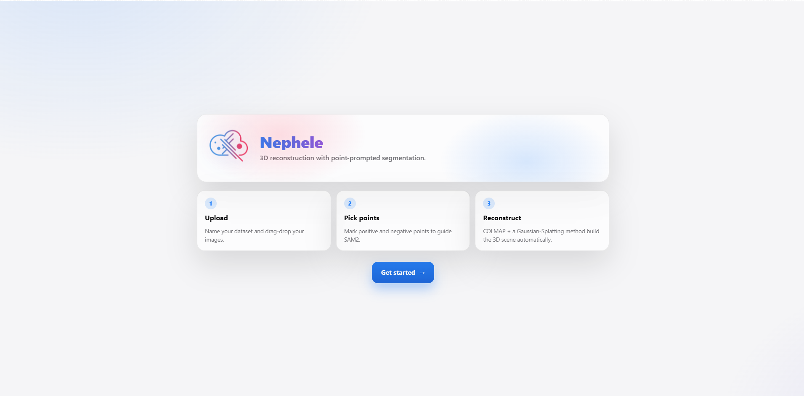
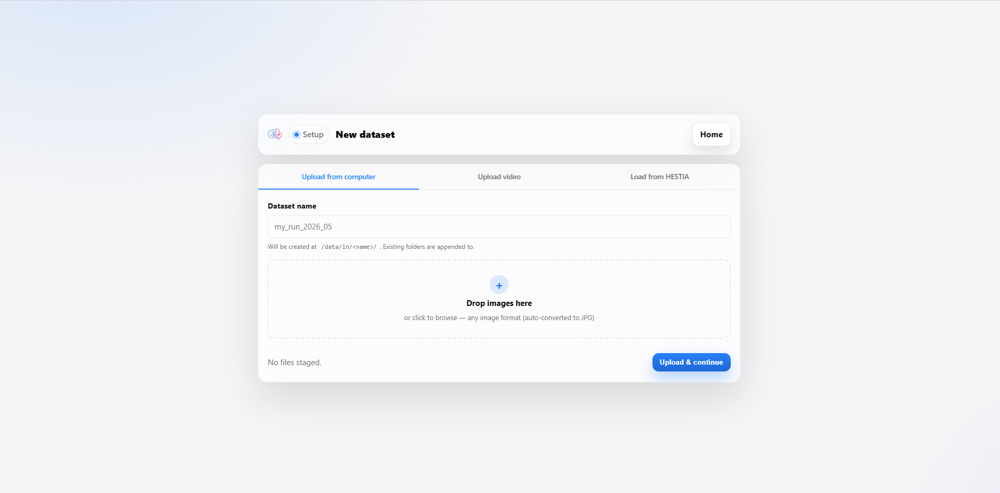
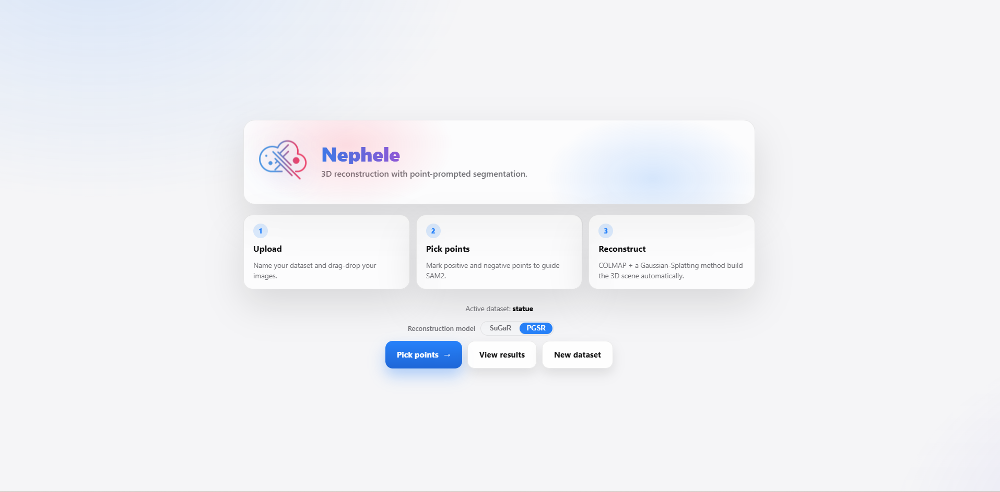
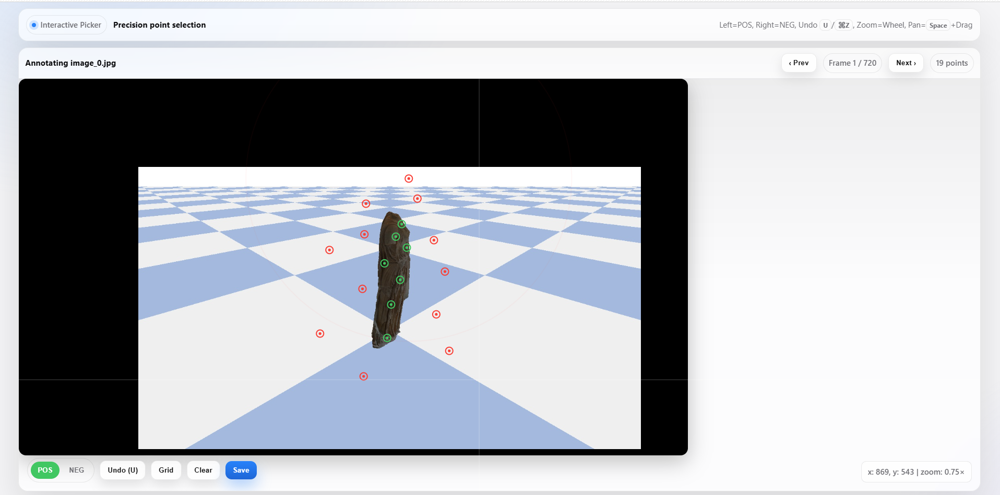
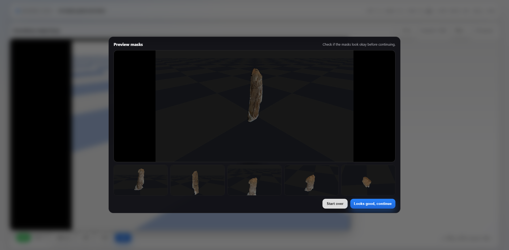
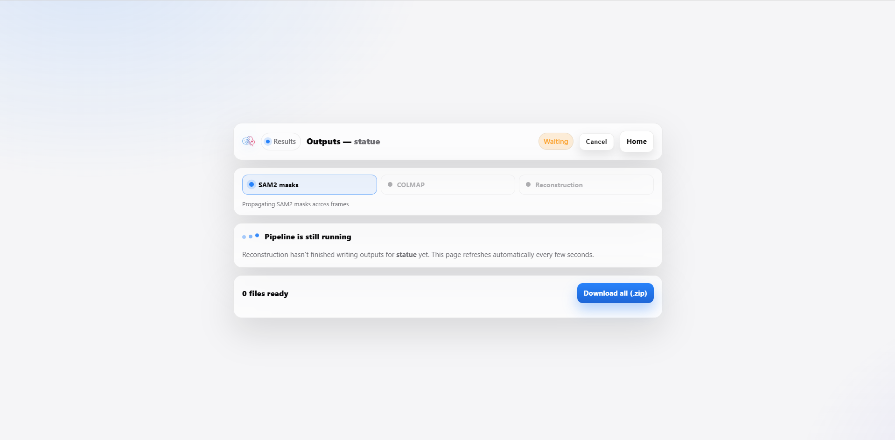
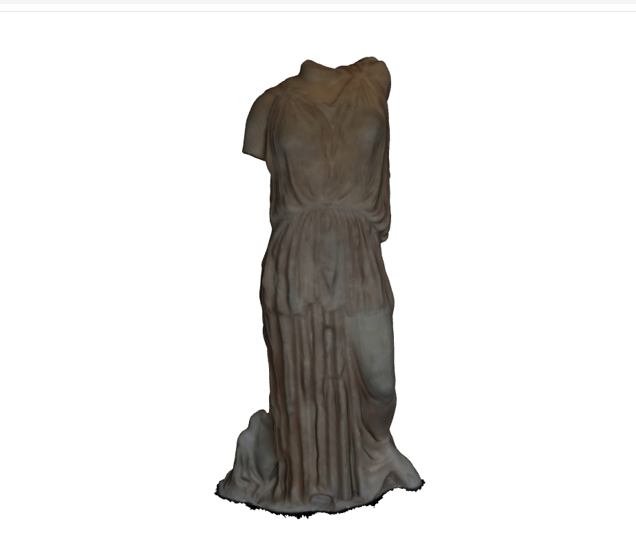

# Nefele UI

Upload images, pick points, and download your 3D model.

**Open in your browser:** https://nephele.textailes.athenarc.gr

---

## Setup (first time only)

1. Clone the repository:
   ```bash
   git clone -b nefele_ui https://github.com/TEXTaiLES/SAMplify_SuGaR.git
   cd SAMplify_SuGaR/nefele_ui
   ```

2. Copy the config file:
   ```bash
   cp .env.example .env
   ```

3. Open `.env` and fill in:
   - `SAMPLIFY_ROOT` — path to the project folder on this machine
   - `HESTIA_API_KEY` — your API key

4. Start:
   ```bash
   docker compose up --build -d
   ```

---

## Stop

```bash
docker compose down
```

---

# UI Usage

## Overview
This project uses the SAM2 and SuGaR frameworks for 3D reconstruction of images, generating high-quality models with background removal. By clicking on points of interest in an image, the SAM2 model generates a mask that isolates the target object.

## Workflow

### Get Started: Stages of Nephele
<p align="center">
  
</p>

### 1. Upload Data
Users can provide input in one of three ways:
- Upload images from a local folder.
- Upload a video, from which frames are automatically extracted.
- Load an existing scan dataset from **HESTIA**, the database of the TexTaiLES project.

<p align="center">
  
</p>

### 2. Model Selection
Choose the Gaussian Splatting model to use: **SuGaR** or **PGSR**.

| Model | When to prefer |
|---|---|
| **SuGaR** | Mature, widely used; good general-purpose default |
| **PGSR** | Better planar surfaces / textiles / thin structures |

<p align="center">
  
</p>

### 3. Image Loading and Point Annotation
Load an image, then click to add points of interest:
- **Left-click** adds a **positive point** (green) — part of the object to keep.
- **Right-click** adds a **negative point** (red) — part to exclude.

<p align="center">
  
</p>

### 4. Generating the Mask with SAM2
Once enough points are added, SAM2 generates a mask that isolates the object, overlaid on the original image for review.

<p align="center">
  
</p>

### 5. Final Output
After reviewing the preview, click **Continue**. Once processing finishes you can download the final `.obj` file — the object isolated from the background, ready for 3D reconstruction.

<p align="center">
  
</p>

<p align="center">
  
</p>
